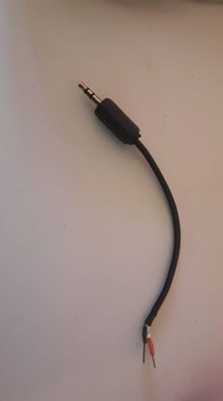
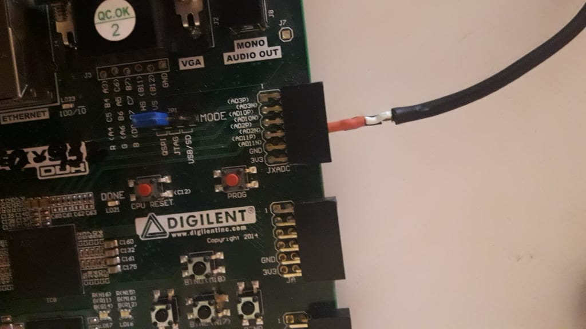

# DigitalAudioProcessorFPGA
Procesador de audio que implementa filtros digitales para ecualizar la señal de entrada utilizando la FPGA Nexys4 DDR de Xilinx.

Para implementar el comportamiento básico descrito,se cuenta con un archivo .bit en la carpeta demo.

Se debe contar con un adaptador jack 3.5mm con las puntas peladas como el siguiente:

Este adaptador debe ser conectado a la entrada auxiliar AD11 (P y N respectivamente) de la FPGA.

Luego se debe grabar el .bit entregado, utilizando Vivado 2017.x en la tarjeta.
El control es el siguiente: 
Switches:
SW[0] -> Permite seleccionar entre filtrar la señal o dejarla tal cual se muestrea.
SW[1],SW[2] -> Permiten seleccionar el filtro que se aplicará.
  {SW[2],SW[1]}: 
      2'b00-> Se hace una combianción lineal de los  3 filtros.
      2'b01-> Se aplica el filtro pasa bajos a la señal.
      2'b10-> Se aplica el filtro pasa medios a la señal.
      2'b11-> Se aplica el filtro pasa altos a la señal.
SW[3],SW[4]-> Permiten modificar la ganancia de los filtros digitales. Cuidado con saturar la señal ya que se escuchará ruidosa.
     {SW[2],SW[1]}: 
      2'b00-> Nada.
      2'b01-> Modifica la ganancia del filtro pasa bajos. Se deben usar los botones BTNU y BTND para aumemtarla o disminuirla.
      2'b10-> Modifica la ganancia del filtro pasa medios. Se deben usar los botones BTNU y BTND para aumemtarla o disminuirla.
      2'b11-> Modifica la ganancia del filtro pasa altos. Se deben usar los botones BTNU y BTND para aumemtarla o disminuirla.

SW[5] -> Activa el modulo Overdrive.. No funciona correctamente.
SW[6] -> Activa el módulo Delay.
SW[7] -> Permite intercambiar lo que se muestra en displays. Para ver la ganancia de los filtros se debe mantener en alto.

Para debugging de salidas de audio.
SW[13] -> Hace que la salida de audio esté conectada directamente a la salida del módulo que implementa los filtros FIR.
SW[14] -> hace que la salida de audio esté conectada directamente a la salida del módulo Overdrive. No funciona correctamente.
SW[15] -> Hace que la salida de audio esté conectada directamente a la salida del módulo Delay.
